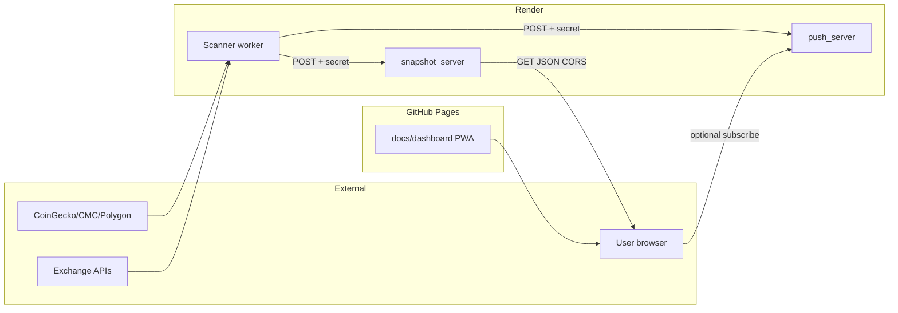

# Threat Model

> STRIDE-oriented threat model for Linear Trend Spotter. Review at milestone boundaries.

## System Overview

Linear Trend Spotter is a Python worker that scans crypto exchanges, writes SQLite caches and JSON snapshots, optionally POSTs to a Flask snapshot relay, and serves a static PWA dashboard via GitHub Pages. Optional Tier-B Web Push relay notifies browsers of list changes.

## Trust Boundaries

## Assets

| Asset | Location | Sensitivity |
|-------|----------|-------------|
| API keys (CMC, CoinGecko, Polygon, etc.) | Render env / local `.env` | High |
| `QUALIFIED_SNAPSHOT_RELAY_SECRET` | Worker + snapshot_server env | High |
| `WEB_PUSH_INTERNAL_SECRET` | Worker + push_server env | High |
| VAPID keys | push_server env | Medium |
| Qualified coin snapshot JSON | Public GET endpoint / GitHub Pages | Low (public by design) |
| SQLite DB / scan caches | Render disk `/var/data` | Medium |
| Push subscription store | push_server filesystem | Medium |

## STRIDE Summary

| Threat | Vector | Mitigation |
|--------|--------|------------|
| **Spoofing** | Unauthorized POST to snapshot relay | Shared secret header; validate in Flask app |
| **Tampering** | MITM on API calls | HTTPS only; pinned provider endpoints |
| **Repudiation** | Operator cannot trace bad deploy | Render logs, `scan_stats.json`, worker log files |
| **Information disclosure** | Secrets in git | Gitleaks CI + pre-commit; `.env` gitignored |
| **Information disclosure** | Snapshot leaks internal paths | Redaction in snapshot writer (EXECUTION_PLAN Q2) |
| **Denial of service** | Flood snapshot GET/POST | Rate limits at Render; minimal public surface |
| **Elevation** | Forge push notifications | Internal secret on worker→push_server calls |

## Top Abuse Cases

1. **Relay ingest without secret** — attacker POSTs malformed snapshot JSON. Mitigated by secret validation and size limits in `snapshot_server`.
2. **Scraping public snapshot** — expected; snapshot is public. No user PII in payload.
3. **API key exfiltration from logs** — mitigated by log redaction tests (`test_benchmark_40_tuned_log_redact.py`).
4. **Web Push subscribe spam** — optional subscribe token; CORS configured per env.

## Out of Scope

- Exchange API account compromise (operator credential hygiene)
- GitHub/Render platform breaches

## Review Cadence

- Update when adding new HTTP surface, auth mechanism, or third-party integration
- Cross-check with `docs/PRIVACY.md` and `SECURITY.md`
